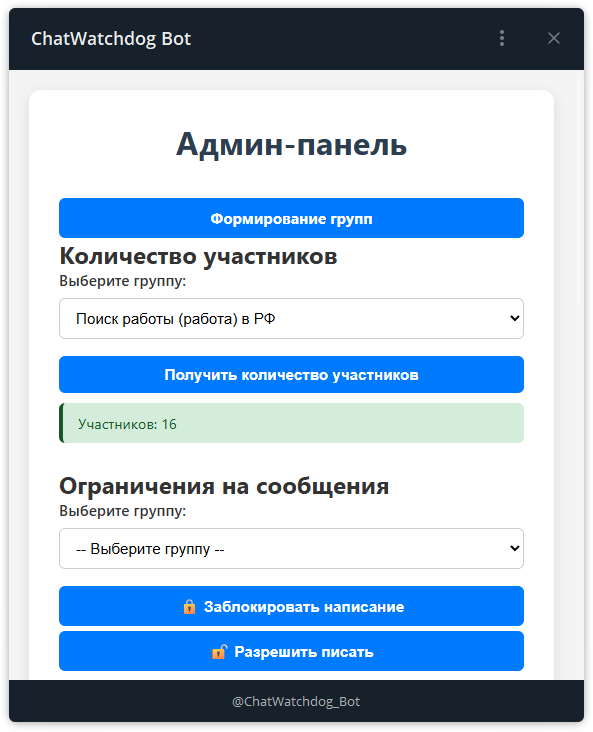

# 📘 TGAdminWebApp: Умный помощник для администрирования Telegram-сообществ

**TGAdminWebApp** — это современный Telegram-бот, разработанный на базе **aiogram 3** и **peewee**, с интегрированной
WebApp-админпанелью. Он обеспечивает удобное и безопасное управление группами и каналами прямо из Telegram.

<div align="center">



</div>

---

## 🆕 Что нового в версии 1.1.0 (12 мая 2025)

* 🔄 **Рефакторинг кода**: Повышена стабильность и читаемость проекта.
* 🛠️ **WebApp-админпанель**: Добавлена удобная панель управления для администраторов.
* 🔐 **Проверка подписки**: Ограничение доступа к функциям бота до подписки на канал.
* 🗃️ **Миграция на Peewee**: Переход с sqlite3 на более гибкую оболочку для базы данных.
* 🌐 **Локализация сообщений**: Частичная поддержка многоязычности для юзеров.

---

## ⚙️ Основные возможности

* 🎛️ **Индивидуальная настройка**
* 👥 **Управление участниками**
* ❌ **Фильтр нежелательного контента**
* 📊 **Статистика по чатам**
* 📌 **Ограничение письма без подписки**

---

## 🧰 Команды бота

* **/start** — Запуск бота
* **/id** — Узнать ID пользователя (в ответ на сообщение)
* Прочие действия — через WebApp

---

## 🔧 Установка и запуск

1. Установка зависимостей:

```bash
pip install -r requirements.txt
```

2. Создание `config.ini`:

```ini
[BOT_TOKEN]
BOT_TOKEN = токен

[TIME_DEL]
TIME_DEL = время удаления

[ADMIN]
ADMIN_ID = айди админа

[telegram_settings]
id = ид для аккаунта
hash = hash для аккаунта
```

3. Файл сессии `session_name.session` должен быть в `scr/setting/`

4. Запуск проекта:

```bash
python run_all.py
```

Или:

```bash
Запуск.bat
```

---

## 🌐 WebApp-панель

Для работы веб-панели используется: [https://my.tuna.am/](https://my.tuna.am/)

📄 Документацию можно найти здесь: [https://tuna.am/docs/](https://tuna.am/docs/)

---

## 📅 Обратная связь

* 📧 **Email**: [zh.vitaliy92@gmail.com](mailto:zh.vitaliy92@gmail.com)
* 💬 **Telegram**: [@PyAdminRU](https://t.me/PyAdminRU)

---

С **TGAdminWebApp** ваше Telegram-сообщество в надёжных руках! ✅
